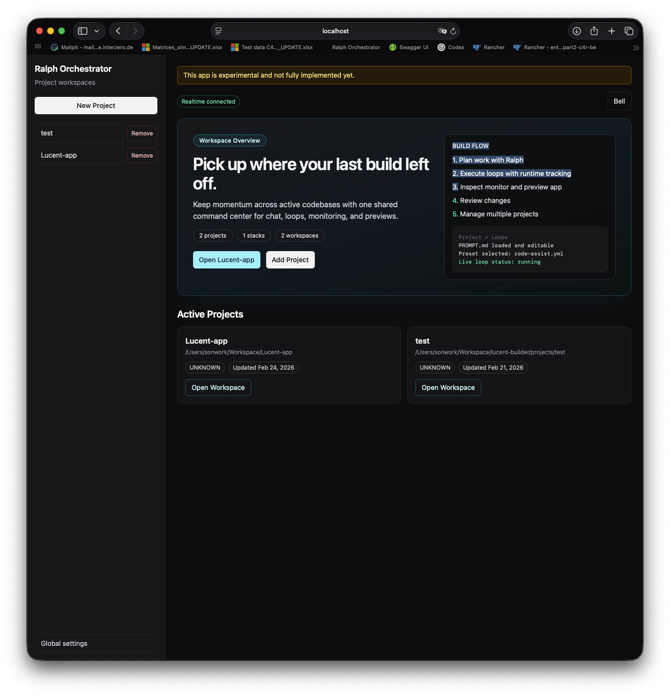
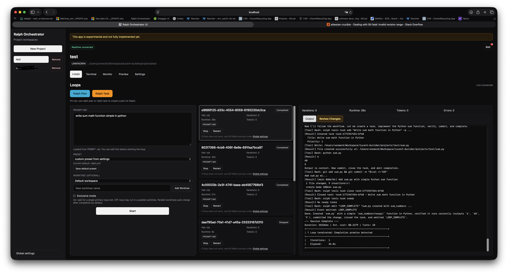
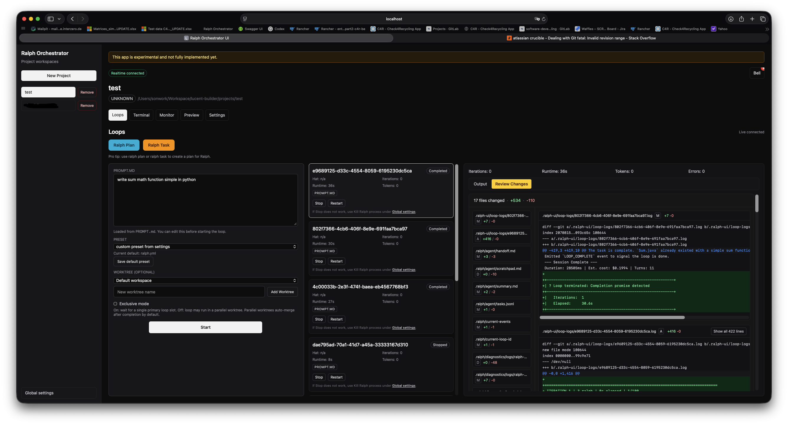
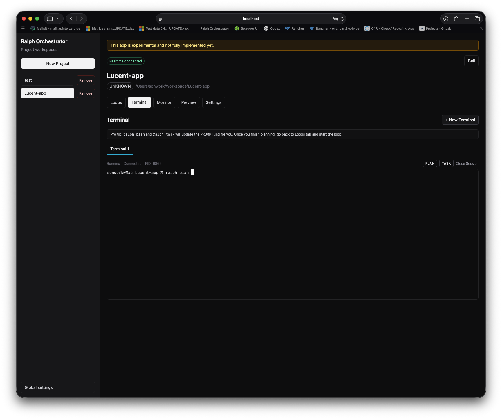
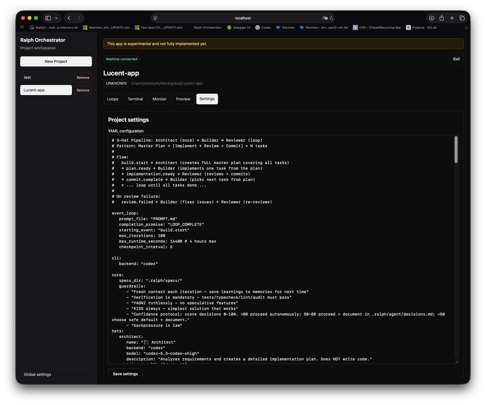

# Ralph Orchestrator Web

A web app for running Ralph workflows across multiple projects, watching loop activity live, and reviewing changes before you ship.

This repo contains:
- `packages/backend`: Fastify + tRPC backend (pretty much copied from ralph-orchestrator, with features built on top)
- `packages/frontend`: React + Vite frontend

This project uses the amazing Ralph-Orchestrator CLI: <https://github.com/mikeyobrien/ralph-orchestrator>

## What This App Does

- Manage many code projects from one dashboard
- Start Ralph loops with a preset + editable `PROMPT.md`
- Stream loop output, state, and metrics in realtime
- Run `ralph plan` / `ralph task` from the Terminal tab, to make a solid plan for ralph loop
- Inspect app behavior in Preview (experimental)
- Review loop diffs in `Review Changes` (experimental)
- Get loop notifications (complete/fail)

## Screenshots

### Dashboard


### Loops (Output)

Callouts:
- Left panel: editable `PROMPT.md`, preset, worktree, exclusive mode
- Middle panel: loop run history
- Right panel (`Output`): live streamed loop output

### Loops (Review Changes)

Callouts:
- `Review Changes` tab for completed/stopped loops
- File list with per-file +/- counts
- Unified diff viewer for quick review before merge

### Terminal (`ralph plan` / `ralph task`)


### Settings


## Quick Start

From repo root:

```bash
npm install
npm run db:migrate -w @ralph-ui/backend
npm run dev
```

Open:
- `http://localhost:5174`

Default dev ports:
- Backend: `3003`
- Frontend: `5174` (proxies `/trpc` and `/ws` to backend)

## Cloud Deployment

This project can run as a single cloud service:
- Backend serves API (`/trpc`, `/ws`, `/chat`, `/mcp`)
- Backend also serves the built frontend SPA

### Option 1: Node Service (Render/Railway/Fly/VM)

From repo root:

```bash
npm install
npm run build
npm run start
```

Recommended environment variables:
- `PORT`: port from your cloud provider (default `3003`)
- `RALPH_UI_BIND_HOST`: set to `0.0.0.0` (root `start` script already does this)
- `RALPH_UI_ALLOWED_ORIGINS`: optional comma-separated allowlist for cross-origin frontend deployments
- `RALPH_UI_DB_PATH`: optional persistent DB path (for example mounted volume path)
- `RALPH_UI_DEFAULT_BACKEND`: optional backend used for quick `ralph plan`/`ralph task` actions when no explicit `--backend` is provided (for cloud deploys typically `opencode`)

Notes:
- Built frontend is loaded from `packages/frontend/dist`.
- If frontend is deployed on another domain, set `VITE_RALPH_ORCHESTRATOR_BACKEND_ORIGIN` at frontend build time and configure `RALPH_UI_ALLOWED_ORIGINS` on backend.

### Option 2: Docker

Docker artifacts exist in the repo, but Docker is not the active/default deployment path right now.

The standard deployment remains:

```bash
npm run deploy
```

That path installs the OpenCode CLI on the host and copies the current OpenCode config from [deploy/opencode.json](/Users/sonwork/Workspace/ralph-orchestrator-web/deploy/opencode.json), which is set to `zai-coding-plan/glm-4.7`.

## First 5 Minutes

1. Create or open a project.
2. Go to `Loops`.
3. Confirm `PROMPT.md` content, edit if needed, choose a preset, click `Start`.
4. Watch live output and status on the right panel.
5. Use `Terminal` to run `ralph plan` / `ralph task` when needed.
6. For finished loops, open `Review Changes`.
7. Open `Preview` for running app output.

## Tabs Overview

- `Loops`: Start/stop/restart loops, stream output, review diffs
- `Terminal`: Interactive project terminal + quick `ralph plan` / `ralph task`
- `Monitor`: Not supported yet (placeholder)
- `Preview`: Start and inspect app preview server output
- `Settings`: Ralph binary path, notifications, preview/network settings, maintenance tools

## Keyboard Shortcuts

- `Cmd/Ctrl+K`: open project quick switcher
- `Cmd/Ctrl+N`: open new project dialog
- `Cmd/Ctrl+1..4`: switch tabs (`Loops` / `Terminal` / `Monitor` / `Preview`)
- `Esc`: close dialogs

## Requirements

- Node.js 18+
- npm
- at least one supported AI CLI

Optional global install:

```bash
npm install -g @ralph-orchestrator/ralph-cli
```

Note:
- This is optional for this repo.
- `@ralph-orchestrator/ralph-cli` is already included as a project dependency and is installed by `npm install`.

### AI Backend CLI Requirements

If you choose a specific AI backend in Loops/Chat, the matching CLI must be installed on your machine.

- `claude` backend: Claude Code CLI (`claude`)
- `codex` backend: Codex CLI (`codex`)
- `gemini` backend: Gemini CLI (`gemini`)
- Other backends (`kiro`, `amp`, `copilot`, `opencode`): install their corresponding CLIs

## Config Notes

### Prompt File Resolution

Loop prompt content is loaded from:
1. `event_loop.prompt_file` in the project config
2. fallback: `PROMPT.md`

### Ralph Binary Resolution

The backend resolves the Ralph binary in this order:
1. `settings.ralphBinaryPath` (from UI Settings)
2. `RALPH_UI_RALPH_BIN`
3. workspace-local `node_modules/.bin/ralph`
4. `ralph` on system `PATH`

### Database Location

- Default: `.ralph-ui/data.db` under backend working directory
- Typical local path in this repo: `packages/backend/.ralph-ui/data.db`
- Override with: `RALPH_UI_DB_PATH`

## Security Model

This app has no authentication layer. Treat it as trusted-environment software.

- Backend bind host defaults to `127.0.0.1` in non-production mode and `0.0.0.0` in production mode
- Localhost origins are allowed for CORS + WebSocket by default
- Additional origins: `RALPH_UI_ALLOWED_ORIGINS`
- Bind another interface: `RALPH_UI_BIND_HOST`
- Dangerous endpoints are blocked on non-loopback hosts by default
- Unsafe override: `RALPH_UI_ALLOW_REMOTE_UNSAFE_OPS=1`

Do not expose this backend to untrusted networks.
See [SECURITY.md](SECURITY.md) for details.

## Workspace Commands

- Lint all workspaces: `npm run lint`
- Test all workspaces: `npm run test`
- Coverage all workspaces: `npm run test:coverage`
- Typecheck all workspaces: `npm run typecheck`
- Complexity check: `npm run complexity`
- Duplication check: `npm run duplication`
- Quick quality gate (lint + typecheck + test): `npm run quality:quick`
- Full quality gate (all checks): `npm run quality`
- Build all workspaces: `npm run build -ws`

### Recommended pre-push check

```bash
npm run quality
```

## More Documentation
check out the ralph orchestrator docs: https://mikeyobrien.github.io/ralph-orchestrator/

## License

This project is licensed under the MIT License.
See [LICENSE](LICENSE).

## Repository Layout

- `packages/backend`: API, services, runtime/process integration
- `packages/frontend`: UI components, routes, realtime clients, state stores
