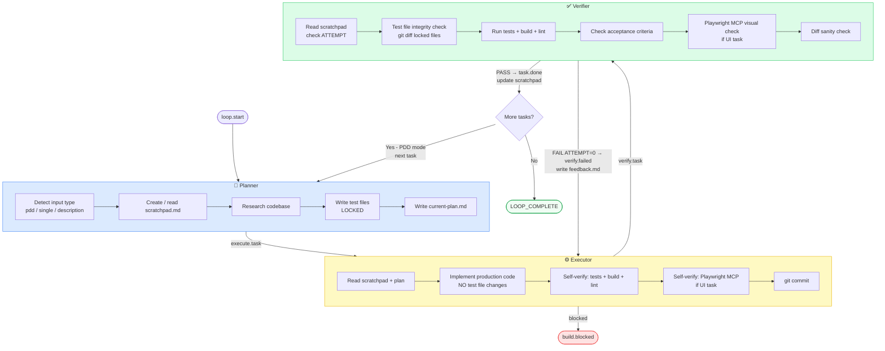

# Ralph Orchestrator — Workflow Diagram

```mermaid
flowchart TD
    START([loop.start]) --> PLANNER

    subgraph PLANNER["📐 Planner"]
        P1[Detect input type\npdd / single / description]
        P2[Create / read scratchpad.md]
        P3[Research codebase]
        P4[Write test files\nLOCKED]
        P5[Write current-plan.md]
        P1 --> P2 --> P3 --> P4 --> P5
    end

    PLANNER -->|execute.task| EXECUTOR

    subgraph EXECUTOR["⚙️ Executor"]
        E1[Read scratchpad + plan]
        E2[Implement production code\nNO test file changes]
        E3[Self-verify: tests + build + lint]
        E4[Self-verify: Playwright MCP\nif UI task]
        E5[git commit]
        E1 --> E2 --> E3 --> E4 --> E5
    end

    EXECUTOR -->|verify.task| VERIFIER

    subgraph VERIFIER["✅ Verifier"]
        V0[Read scratchpad\ncheck ATTEMPT]
        V1[Test file integrity check\ngit diff locked files]
        V2[Run tests + build + lint]
        V3[Check acceptance criteria]
        V4[Playwright MCP visual check\nif UI task]
        V5[Diff sanity check]
        V0 --> V1 --> V2 --> V3 --> V4 --> V5
    end

    VERIFIER -->|PASS → task.done\nupdate scratchpad| TASK_DONE{More tasks?}
    VERIFIER -->|FAIL ATTEMPT=0 → verify.failed\nwrite feedback.md| EXECUTOR

    TASK_DONE -->|Yes - PDD mode\nnext task| PLANNER
    TASK_DONE -->|No| DONE([LOOP_COMPLETE])

    EXECUTOR -->|blocked| BUILD_BLOCKED([build.blocked])

    style PLANNER fill:#dbeafe,stroke:#3b82f6
    style EXECUTOR fill:#fef9c3,stroke:#eab308
    style VERIFIER fill:#dcfce7,stroke:#22c55e
    style DONE fill:#f0fdf4,stroke:#16a34a
    style BUILD_BLOCKED fill:#fee2e2,stroke:#ef4444
```
