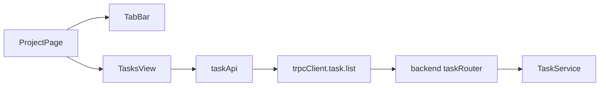
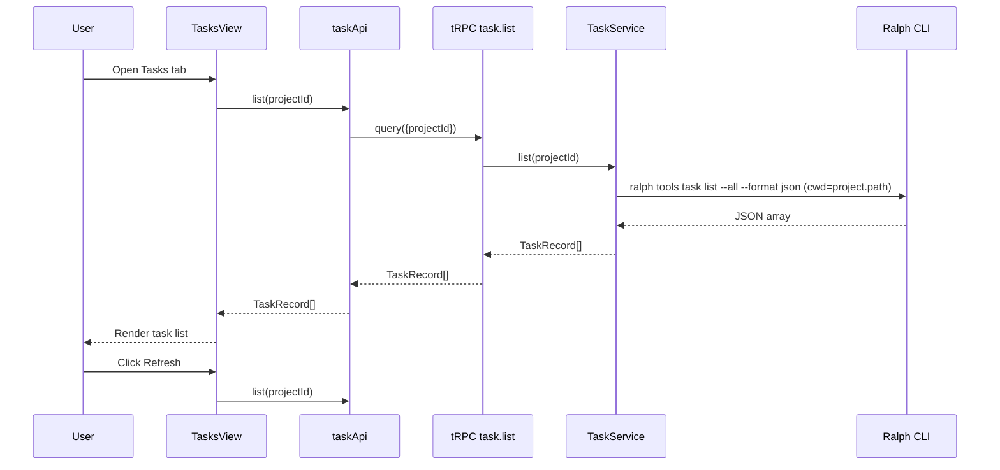

# App Task Listing Design

## Overview
Add a new **Tasks** tab in project view that lists Ralph runtime tasks for the selected project. The tab auto-loads tasks on open and supports manual refresh. The implementation is read-only for now: no filtering, sorting, search, or task actions.

Primary user: normal app user.

Task source: Ralph CLI command scoped to project root.
- Command: `ralph tools task list --all --format json`
- Effective root: selected project path (`cwd=project.path` or `--root project.path`)

## Detailed Requirements

### Functional requirements
1. The project page includes a separate **Tasks** tab.
2. Opening the Tasks tab automatically loads tasks.
3. User can manually refresh tasks.
4. Task list includes all task states (open + in_progress + closed + failed).
5. Task cards/rows display at least:
   - `id`
   - `title`
   - `description`
   - `status`
   - `priority`
   - `blocked_by`
   - `loop_id`
   - `created`
   - `closed`
6. Data is fetched from Ralph CLI JSON output using:
   - `ralph tools task list --all --format json`
7. CLI execution must target the selected project path, not arbitrary shell cwd.

### Non-functional requirements
1. On fetch failure, show an error message in the Tasks tab.
2. Local Ralph installation is supported if backend can resolve executable path (configured custom path, local `node_modules/.bin/ralph`, or PATH).
3. Invalid/missing project path or non-runnable Ralph command should fail gracefully with clear error messaging.
4. Keep existing project tabs and behaviors unchanged except adding Tasks tab navigation.

### Out of scope
1. Task mutation actions (`add`, `close`, `fail`, etc.).
2. Filtering/sorting/search.
3. Task detail drill-down.
4. Realtime subscription for task changes.

## Architecture Overview

The feature adds a thin vertical slice across frontend and backend:
- Frontend: new Tasks view + tab navigation + API client wrapper.
- Backend: new task service that shells out to Ralph and returns parsed JSON.
- Transport: tRPC `task.list` query.

```mermaid
flowchart TB
  UI[Project Tasks Tab] --> FEAPI[frontend taskApi.list(projectId)]
  FEAPI --> TRPC[tRPC task.list]
  TRPC --> SVC[TaskService.list(projectId)]
  SVC --> DB[(projects table)]
  SVC --> BIN[resolve Ralph binary]
  SVC --> CLI[ralph tools task list --all --format json]
  CLI --> FILE[projectRoot/.ralph/agent/tasks.jsonl]
  CLI --> JSON[stdout JSON array]
  JSON --> SVC
  SVC --> TRPC
  TRPC --> UI
```

## Components and Interfaces

### Backend
1. `TaskService` (new)
   - Responsibility: retrieve project path, execute Ralph command in project root, parse/validate JSON task array, surface domain errors.
   - Suggested methods:
     - `list(projectId: string): Promise<TaskRecord[]>`
   - Dependencies:
     - DB access for project lookup
     - Ralph binary resolver (`resolveRalphBinary` + configured setting)
     - `execFile`/spawn wrapper for command execution

2. `TaskServiceError` (new)
   - Similar pattern to other service errors.
   - Codes:
     - `NOT_FOUND` (project missing)
     - `BAD_REQUEST` (invalid path/invalid output)

3. tRPC router additions
   - New `taskRouter` with `list` query input `{ projectId: string }`.
   - Add router to `appRouter` as `task`.

### Frontend
1. `taskApi` module (new)
   - `list(projectId: string): Promise<TaskRecord[]>`
   - Uses `trpcClient.task.list.query({ projectId })`.

2. `TasksView` component (new)
   - Props: `{ projectId: string }`.
   - Behavior:
     - Auto-fetch on mount/project change.
     - `Refresh` button triggers reload.
     - Renders loading, error, empty, and list states.

3. Project navigation updates
   - `TabBar`: add `Tasks` item.
   - `ProjectPage`: include `tasks` tab mapping.
   - `validTabs` updates to include `tasks`.

4. Optional presentational subcomponents
   - `TaskList` and `TaskCard` for maintainability, mirroring existing loops component structure.



## Data Models

### Task record returned to frontend
```ts
interface TaskRecord {
  id: string
  title: string
  description: string
  status: 'open' | 'in_progress' | 'closed' | 'failed' | string
  priority: number | null
  blocked_by: string[]
  loop_id: string | null
  created: string | null // ISO timestamp
  closed: string | null // ISO timestamp
}
```

### API contract
- Query: `task.list({ projectId })`
- Response: `TaskRecord[]`
- Ordering: preserve CLI output order (newest behavior delegated to Ralph CLI).

### Data flow


## Error Handling

### Backend errors
1. Project not found in DB
   - Return `NOT_FOUND`.
2. Project path invalid/inaccessible
   - Return `BAD_REQUEST` with actionable message.
3. Ralph binary not resolvable or not executable
   - Return `BAD_REQUEST` with resolver message.
4. CLI exits non-zero
   - Return `BAD_REQUEST` with stderr summary.
5. CLI returns invalid JSON
   - Return `BAD_REQUEST` with parse failure message.

### Frontend behavior
1. Initial load failure: show error message in Tasks tab.
2. Refresh failure: show error message and keep previously rendered list if present.
3. Empty array: show neutral empty state text (for example, "No tasks found for this project").
4. Loading state: show simple loading indicator while request is in flight.

## Acceptance Criteria

1. Given an existing project with Ralph task data under its root, when user opens `/project/:id/tasks`, then the app issues exactly one list request and renders all returned tasks.
2. Given tasks include closed entries, when Tasks tab loads, then closed tasks are visible without additional user action.
3. Given user is on Tasks tab, when user clicks Refresh, then the app re-runs task fetch and updates list contents.
4. Given Ralph binary cannot be resolved, when Tasks tab loads or refreshes, then user sees an error message in the Tasks view.
5. Given project path is invalid/inaccessible, when task list is requested, then backend returns an error and frontend displays that error.
6. Given CLI returns empty array, when Tasks tab loads, then UI shows an empty state instead of failing.
7. Given user switches to other tabs (Loops/Terminal/Monitor/Preview/Settings), when navigation occurs, then existing tab behavior is unchanged.

## Testing Strategy

### Backend tests
1. Add `packages/backend/test/task.test.ts`:
   - Success: returns parsed JSON tasks for valid project path.
   - Uses selected project path as `cwd` (or `--root` if chosen implementation).
   - Project missing -> `NOT_FOUND`.
   - Binary resolution failure -> `BAD_REQUEST`.
   - Non-zero CLI exit -> `BAD_REQUEST` with message.
   - Invalid JSON output -> `BAD_REQUEST`.
2. Router-level coverage:
   - `task.list` validates input and maps service errors through `asTRPCError`.

### Frontend tests
1. Add `TasksView.test.tsx`:
   - Auto-load on mount.
   - Refresh triggers second request.
   - Error state renders message.
   - Empty state renders with `[]`.
   - Renders required fields for at least one task fixture.
2. Update navigation tests (`App.test.tsx` or `ProjectPage` tests):
   - Tasks tab link appears.
   - Route `/project/:id/tasks` renders Tasks view.

### Manual verification
1. Open project with known `.ralph/agent/tasks.jsonl` data.
2. Confirm Tasks tab displays open and closed tasks.
3. Modify task state via CLI, press Refresh, verify UI updates.
4. Temporarily break Ralph binary path in settings, confirm error message appears.

## Appendices

### A) Technology Choices
1. Keep transport on existing tRPC stack for consistent typed backend access.
2. Use backend shell execution of Ralph CLI rather than direct file parsing to align with Ralph command contract and future compatibility.
3. Reuse current service error + router error mapping patterns for consistency.

### B) Research Findings Summary
1. Correct command is `ralph tools task list --all --format json`.
2. Task data is root-scoped: different roots return different task sets.
3. This environment stores runtime tasks under `.ralph/agent/tasks.jsonl` for the selected root.
4. `--root` can be used for explicit deterministic root targeting; equivalent behavior achieved with `cwd`.

### C) Alternative Approaches
1. Directly read `.ralph/agent/tasks.jsonl` from filesystem.
   - Rejected: bypasses Ralph CLI contract and risks drift if internal storage format changes.
2. Use current shell cwd without project binding.
   - Rejected: wrong data in multi-project UI context.
3. Add realtime task websocket channels now.
   - Deferred: unnecessary for current requirement (manual refresh only).

### D) Known Limitations
1. Task list freshness depends on manual refresh or tab reopen.
2. CLI execution latency can affect perceived load speed for large task history.
