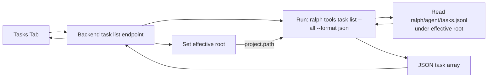

# Ralph Task List Source Research

Date: 2026-02-24
Scope: Verify where `ralph tools task list` reads tasks from and how path selection should work.

## Research Plan Executed
1. Inspect CLI help for task list command and flags.
2. Run controlled command comparisons across two directories.
3. Inspect local runtime task files in workspace and empty directory.

## Findings

### 1) Correct command for list + JSON
`ralph tools task list --all --format json`

From `ralph tools task list --help`:
- `--all` includes closed/failed tasks.
- `--format json` provides structured output.
- `--root <ROOT>` sets working directory for task resolution.

### 2) Task source is path-scoped (project/workspace root), not globally shared
Empirical verification:
- In `/Users/sonwork/Workspace/lucent-builder`, no `--root` returns task array.
- In same shell, `--root /tmp/ralph-empty-root` returns `[]`.
- From `/tmp/ralph-empty-root`, no `--root` returns `[]`.
- From `/tmp/ralph-empty-root`, `--root /Users/sonwork/Workspace/lucent-builder` returns the same task array as workspace.

Conclusion: command reads task data for the effective root (`cwd` unless `--root` is provided).

### 3) Local data backing in this environment
Observed in workspace:
- `.ralph/agent/tasks.jsonl` exists and contains task records matching CLI output.
Observed in empty directory after command:
- `.ralph/agent/tasks.jsonl.lock` created; no task entries returned.

This is consistent with path-scoped runtime task storage under the selected root.

## Data Flow

## Recommendation
- Keep task listing tied to the selected app project path.
- Backend should execute with `cwd = project.path` (or pass `--root project.path`) to ensure deterministic project-scoped results.
- If target path is invalid/non-Ralph, return an error message in the Tasks tab.

## Sources
- Local command help: `ralph tools task list --help`
- Local verification commands run on 2026-02-24:
  - `ralph tools task list --all --format json`
  - `ralph tools task list --all --format json --root /Users/sonwork/Workspace/lucent-builder`
  - `ralph tools task list --all --format json --root /tmp/ralph-empty-root`
  - Same commands from `cwd=/tmp/ralph-empty-root`
- Local files inspected:
  - `/Users/sonwork/Workspace/lucent-builder/.ralph/agent/tasks.jsonl`
  - `/tmp/ralph-empty-root/.ralph/agent/tasks.jsonl.lock`
