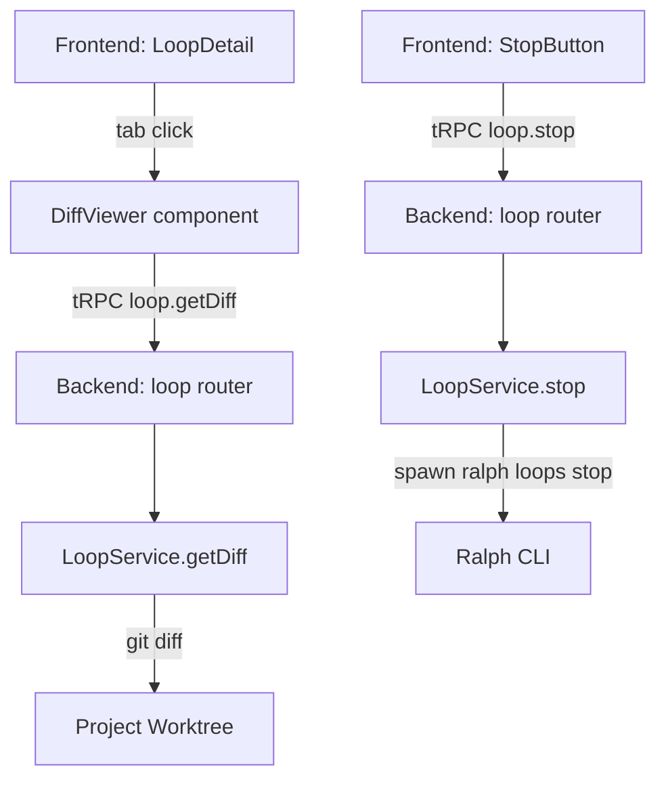

# Design: Lucent Builder Improvements

## Overview

Two improvements to the lucent-builder application:

1. **Code Review Diff Viewer** — A read-only unified diff panel in the loop detail view that shows what Ralph changed on the worktree branch vs the base branch.
2. **Fix Stop Button** — Make the Stop button truly kill a running loop by invoking `ralph loops stop` instead of sending OS signals directly to the child process.

---

## Detailed Requirements

### Feature 1: Code Review Diff Viewer

- **Entry point:** "Review Changes" tab in the loop detail view, visible when loop state is `completed`, `needs-review`, `merged`, or `stopped`.
- **Diff scope:** Worktree branch vs base branch (`git diff <base>..<worktree>`). The base branch is determined by the project's default branch (falls back to `main`).
- **Display style:** Unified diff (single column), monospace font, syntax highlighting via line prefix (+/-).
- **File display:** All files open by default, showing a limited number of lines (30). Each file has an expand/collapse toggle ("Show all N lines" / "Collapse").
- **Navigation:** Left sidebar listing all changed files with +/- line counts. Clicking a file scrolls to its diff section.
- **Header:** Summary bar showing total files changed, total lines added (+), total lines removed (-).
- **Read-only:** No comments, no actions — purely a diff viewer.
- **No worktree, no diff:** If the loop has no worktree set, show an informational empty state ("No worktree — diff not available").

### Feature 2: Fix Stop Button

- The "Stop" button in the loop detail view must reliably terminate the Ralph process and all its child processes.
- Use `ralph loops stop --loop-id <id>` (or equivalent Ralph CLI flags) instead of sending OS signals to the Node.js child process.
- If Ralph is not running (loop already completed/stopped), the stop call should be a no-op or update the DB state.
- The existing tRPC `loop.stop` mutation is the entry point; only `LoopService.stop()` needs updating.

---

## Architecture Overview



---

## Components and Interfaces

### Backend

#### `LoopService.getDiff(loopId)` — new method

```typescript
async getDiff(loopId: string): Promise<LoopDiff>
```

- Loads the loop row to get `projectId` and `worktree`.
- Returns `{ available: false, reason: string }` if no worktree is set.
- Determines base branch: runs `git symbolic-ref refs/remotes/origin/HEAD` → strips `refs/remotes/origin/`; falls back to `main`.
- Runs: `git diff <baseBranch>...<worktreeBranch> --` in `project.path`.
- Parses the raw unified diff into `DiffFile[]`.
- Returns `{ available: true, baseBranch, worktreeBranch, files, stats }`.

```typescript
export interface DiffFile {
  path: string           // e.g. "src/app.ts"
  status: 'M' | 'A' | 'D' | 'R'
  diff: string           // raw unified diff for this file
  additions: number
  deletions: number
}

export interface LoopDiff {
  available: boolean
  reason?: string        // when available=false
  baseBranch?: string
  worktreeBranch?: string
  files?: DiffFile[]
  stats?: { filesChanged: number; additions: number; deletions: number }
}
```

#### `LoopService.stop(loopId)` — updated

Replace the `processManager.kill()` call with a `ralph loops stop` invocation:

```typescript
// Instead of:
await this.processManager.kill(runtime.processId)

// Do:
const binaryPath = await this.resolveBinary()
await execa(binaryPath, ['loops', 'stop', '--loop-id', loopId], { cwd: project.path })
```

The runtime's `active` flag and DB state update are handled by the existing `handleState` listener when the process exits.

#### tRPC router — new procedure

```typescript
getDiff: t.procedure
  .input(z.object({ loopId: z.string().min(1) }))
  .query(({ ctx, input }) =>
    ctx.loopService.getDiff(input.loopId).catch((error) => asTRPCError(error))
  ),
```

### Frontend

#### `DiffViewer` — new component

Location: `packages/frontend/src/components/loops/DiffViewer.tsx`

Props:
```typescript
interface DiffViewerProps {
  loopId: string
}
```

Layout:
```
┌──────────────────────────────────────────────────────────┐
│  Header: 3 files changed  +42  -7                        │
├──────────────┬───────────────────────────────────────────┤
│ Sidebar      │ Diff area                                 │
│              │                                           │
│ M src/app.ts │ src/app.ts  [M]  +12 -3    [Collapse ▲] │
│   +12 -3     │ @@ -10,7 +10,9 @@                        │
│              │   function init() {                       │
│ A src/new.ts │ -  const x = 1;                          │
│   +30 -0     │ +  const x = 2;                          │
│              │ +  const y = 3;                           │
└──────────────┴───────────────────────────────────────────┘
```

State:
- `expandedFiles: Set<string>` — tracks which files are expanded beyond 30 lines
- Uses `trpc.loop.getDiff.useQuery({ loopId })` — fetched on mount

Diff line rendering:
- Lines starting with `+` → green background, `+` prefix
- Lines starting with `-` → red background, `-` prefix
- `@@` hunk headers → muted/secondary style
- Context lines → default text

File sidebar item: filename, change type badge (M/A/D), `+X -Y` counts in green/red.

#### `LoopDetail` — updated

Add a "Review Changes" tab alongside existing tabs. Tab is only shown when `loop.state` is one of: `completed`, `needs-review`, `merged`, `stopped`.

---

## Data Models

No new DB tables needed. The existing `loopRuns.worktree` column provides the branch name.

---

## Error Handling

| Scenario | Behavior |
|---|---|
| Loop has no worktree | Show "No worktree configured — diff unavailable" empty state |
| `git diff` fails | Show error message with raw stderr |
| `ralph loops stop` fails | Surface tRPC error to frontend; toast notification |
| getDiff called on non-existent loop | tRPC NOT_FOUND error |

---

## Acceptance Criteria

**Diff Viewer:**
- Given a completed loop with a worktree, when the user opens the "Review Changes" tab, then the diff viewer shows changed files with +/- line counts in a sidebar and unified diff in the main panel.
- Given a loop with no worktree set, when the user opens "Review Changes", then an empty state is shown with a clear message.
- Given a file with more than 30 lines of diff, when the file is rendered, then only 30 lines are shown with a "Show all N lines" button; clicking it reveals all lines.
- Given changed files in the sidebar, when the user clicks a file name, then the page scrolls to that file's diff.

**Stop Button:**
- Given a running loop, when the user clicks Stop, then `ralph loops stop` is invoked and the loop transitions to `stopped` state.
- Given an already-stopped loop, when the user clicks Stop, no error is thrown.

---

## Testing Strategy

- Unit tests for `LoopService.getDiff()` — mock `execa` for `git diff`, assert parsing logic.
- Unit tests for diff parsing utility — given raw unified diff strings, assert correct `DiffFile` extraction.
- Integration test for the updated `LoopService.stop()` — mock `execa` for `ralph loops stop`, assert it's called with correct args.
- Frontend: RTL tests for `DiffViewer` — mock tRPC query, assert file list renders, expand/collapse works.

---

## Appendix: Technology Choices

- **Diff parsing:** Custom parser (no library needed) — split on `diff --git` header lines, count `+`/`-` lines per file. Simple and sufficient for unified diffs.
- **`execa`:** Already available or can use Node's `child_process.execFile` / `promisify` — for running `git diff` and `ralph loops stop`.
- **Syntax highlighting:** CSS class-based (green/red backgrounds on +/- lines) — no extra library. Clean and fast.
- **Scrolling:** Native `element.scrollIntoView()` with file `id` anchors in the diff area.

## Appendix: Alternatives Considered

- **Side-by-side diff:** Rejected — more complex to render, unified is sufficient for Ralph's typical change sizes.
- **OS signal kill (SIGKILL):** Rejected — does not propagate to child processes spawned by Ralph (e.g. Claude CLI). `ralph loops stop` lets Ralph clean up gracefully.
- **react-diff-viewer library:** Rejected — adds dependency for minimal gain; custom rendering is straightforward for unified diffs.
